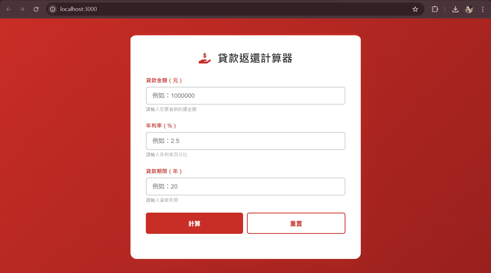

# 第1次練習題目-練習-PC1
>
>學號：112111102
><br />
>姓名：吳映潔
>

本份文件包含以下主題：(至少需下面兩項，若是有多者可以自行新增)
- [x] 說明內容

## 說明程式與內容

> 老師您好，我在answer.md的格式上做了一些微調（原模板感覺更像期中考格式）。若與您要求的格式有出入，還請老師見諒。

這次練習主要是把原本擠在一起的 2b.js 拆開，重構成模組化設計。

1. 

### 程式部分：

### 第一部分：MIME 類型模組
[cite_start]把原本亂放的 MIME 列表抽出來放到 `utils/mimeTypes.js` [cite: 10, 12][cite_start]。還寫了 `getContentType` 函式來查格式，要是沒查到副檔名就給預設值，比較保險 [cite: 13]。

```js
const contentTypes = {
  '.html': 'text/html; charset=utf-8',
  '.ejs': 'text/html; charset=utf-8',
  '.js': 'text/javascript; charset=utf-8',
  '.css': 'text/css; charset=utf-8',
  '.json': 'application/json',
  '.png': 'image/png',
  '.jpg': 'image/jpg',
  '.gif': 'image/gif',
  '.svg': 'image/svg+xml',
  '.ico': 'image/x-icon'
};

export function getContentType(extname) {
  return contentTypes[extname] || 'text/plain';
}
```

> 本來在 2b.js 是直接拿物件來用，現在包成函式還加了預設值，程式比較不會掛掉。

### 第二部分：模板渲染模組

這部分負責處理 EJS。把讀檔跟渲染包成 renderTemplate ，加上一個 render404 方便隨時呼叫。

```js
import fs from 'fs';
import ejs from 'ejs';

export function renderTemplate(res, filePath, data = {}) {
  fs.readFile('.' + filePath, 'utf8', (err, template) => {
    if (err) {
      res.writeHead(500, { 'Content-Type': 'text/html; charset=utf-8' });
      res.end('錯誤：無法讀取模板文件 - ' + err.message);
      return;
    }

    try {
      const html = ejs.render(template, data);
      res.writeHead(200, { 'Content-Type': 'text/html; charset=utf-8' });
      res.end(html);
    } catch (renderErr) {
      res.writeHead(500, { 'Content-Type': 'text/html; charset=utf-8' });
      res.end('渲染錯誤：' + renderErr.message);
    }
  });
}

export function render404(res) {
  renderTemplate(res, '/index3.ejs');
}
```
> 多加了 try...catch 抓渲染錯誤，這樣 EJS 寫錯時才不會讓整個伺服器掛掉。

### 第三部分：靜態文件處理模組

處理 CSS、JS 那些靜態檔案。檔案存在就照設定格式送出，不在就直接丟 404 頁面。

```js
import fs from 'fs';
import path from 'path';
import { getContentType } from './mimeTypes.js';
import { render404 } from './templateRenderer.js';

export function handleStaticFile(res, filePath) {
  const staticFilePath = '.' + filePath;
  const extname = path.extname(filePath);

  fs.readFile(staticFilePath, (err, content) => {
    if (err) {
      render404(res);
    } else {
      const contentType = getContentType(extname);
      res.writeHead(200, { 'Content-Type': contentType });
      res.end(content);
    }
  });
}
```

> 把查路徑、讀檔、設定格式跟報錯通通包在一起。

### 第四部分：重構主檔案

現在主檔案 2b-refactored.js 變超簡短，只要看 URL 走哪條路就好，細節都交給前面的模組。

```js
import http from 'http';
import { renderTemplate } from './utils/templateRenderer.js';
import { handleStaticFile } from './utils/staticFileHandler.js';

http.createServer((req, res) => {
  const url = req.url;

  switch (url) {
    case '/':
      // 渲染首頁
      renderTemplate(res, '/index.ejs', { data: "您好 xxx" });
      break;
    
    case '/calculator':
      // 渲染計算機
      renderTemplate(res, '/index2.ejs');
      break;

    default:
      // 其他都當靜態檔案試試看
      handleStaticFile(res, url);
      break;
  }

}).listen(3000, () => {
  console.log('伺服器已啟動！請訪問 http://localhost:3000');
});
```

> 引入那三個寫好的模組後，用 switch 判斷路由。

### 執行成果：

1. 首頁渲染 (/)



2. 計算器頁面 (/calculator)


3. 404 錯誤頁面與靜態檔案處理測試

